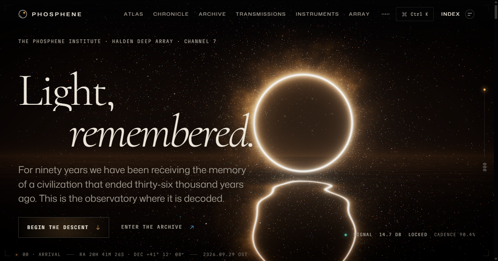

# PHOSPHENE — The Observatory of Remembered Light



**Live: <https://phosphene.arnavrival12.workers.dev>**

PHOSPHENE is an interactive work of science fiction: a real-time observatory for a signal that does not exist. In 2236 the Halden Deep Array, on the far side of the Moon, turned toward a region of Cygnus that contained nothing — and found light arriving in patterns. It is the Serein Signal: the memory of the Ithra, a civilization that ended thirty-six thousand years ago, sent as seven narrow spectral lines. The site is the Phosphene Institute's public observatory. Everything in it — every star, relic, world, glyph and sound — is generated in the browser.

## What's inside

| Route                              | What it is                                                                                                                                                                                                                                                                 |
| ---------------------------------- | -------------------------------------------------------------------------------------------------------------------------------------------------------------------------------------------------------------------------------------------------------------------------- |
| `/` **Arrival**                    | A scroll-driven descent to the Lacuna: a ray-traced ring of light over a mirror-black sea, particle formations for each age, a passage through the ring.                                                                                                                   |
| `/atlas` **Atlas**                 | The Vael system as an explorable orrery, with an epoch slider that swells the dying star until it swallows its inner worlds.                                                                                                                                               |
| `/chronicle` **Chronicle**         | Seven ages of Ithran history; the particle field re-forms for each.                                                                                                                                                                                                        |
| `/archive` **Archive**             | Twenty-four relics reconstructed as holograms (geometry built in a Web Worker), searchable and filterable.                                                                                                                                                                 |
| `/transmissions` **Transmissions** | Five stories, each with its own layout — including a logbook with redactions and an essay about silence.                                                                                                                                                                   |
| `/instruments` **Instruments**     | Six working simulations: wave interference, Chladni resonance, a million-particle gravity loom (GPGPU), a glyph synthesizer, spectral terrain (with optional microphone input) and a generative aurora.                                                                    |
| `/array` **The Array — live**      | A lunar crater with 64 instanced dishes tracking the source; a receiver worker synthesising the carrier into a live spectrogram; telemetry, dish states and a decoder log that every visitor sees identically at the same moment; day and night that follow the real Moon. |
| `/map` **Map**                     | Everything as a navigable constellation, linked by meaning, with your own path through the observatory traced in light.                                                                                                                                                    |
| `/institute` **Institute**         | How the signal is decoded, the principles the Institute keeps, its people, questions and a colophon.                                                                                                                                                                       |
| `/settings` **Calibration**        | Motion, graphics quality, sound, theme, contrast, cursor, grain, intro and progress.                                                                                                                                                                                       |
| `/transmission-zero`               | Twelve lines, decoded one at a time by using the observatory.                                                                                                                                                                                                              |
| `/credits`                         | A cinematic roll.                                                                                                                                                                                                                                                          |
| anywhere else                      | A lost signal. Tune the receiver.                                                                                                                                                                                                                                          |

There is also a command console (`Ctrl K` / `⌘K`), an observer terminal (`` ` ``), keyboard jumps (`G` then a letter), and a few other things for people who go looking.

## How it's built

- **One WebGL context for the whole site.** A persistent stage renders behind every page; routes request scenes, and the engine swaps them behind a "blink" transition. Each scene is its own chunk, loaded only when visited. React never touches three.js directly — pages talk to scenes through a three-free handle and typed events.
- **Custom engine on vanilla three.js.** A quality system (ultra / high / balanced / eco) classifies the GPU, adapts to measured frame times, and can be overridden by the visitor. Post-processing (bloom, ACES, aberration) runs through a NaN guard so one bad pixel can never black out a frame.
- **Shaders written for real hardware.** Small shaders with single call sites, a shared noise texture instead of inlined simplex noise, uniform loop bounds — so ANGLE's Direct3D compiler on integrated Windows GPUs never stalls. The home scene ray-traces its sky, ring and sea analytically; the Array's sky continues its crater floor analytically to the horizon.
- **Simulation.** GPGPU particle systems (up to 1M particles), a ping-pong afterimage buffer, deterministic force layouts, an FFT (used live in a Web Worker), and a model of the Array that derives dish states, telemetry and logs from the wall clock and the real lunar phase.
- **Sound.** Synthesised with the Web Audio API, never sampled and never autoplayed. Every tone is a spectral line's light frequency transposed down forty octaves.
- **Content as data.** Places, relics, worlds, ages, stories and fragments live in typed content modules that feed the pages, the command console, the map, the tests and the prerenderer.

**Stack:** React 19, React Router, TypeScript (strict), Vite, three.js, postprocessing, GSAP, Lenis, zustand, Vitest, ESLint.

## Performance and accessibility

- Code-split routes and scenes; the renderer loads in parallel with the first route; scenes pause when hidden and dispose everything they allocate.
- Adaptive quality with a manual override; device-pixel-ratio caps per tier; a 30 fps cap on the eco tier.
- Every WebGL experience has an HTML equivalent: real links for every star on the map, the dish grid on the Array, lists and text for everything visual. Canvases are decorative to assistive technology.
- Reduced motion is honoured (and can be forced in Calibration): animation stops, scroll-driven sequences become static, the credits stop rolling.
- Keyboard access throughout: focusable interaction surfaces with instructions, roving focus in grids, a skip link, route announcements, and visible focus styles.
- Every page is prerendered with its own title, description, canonical URL, Open Graph card and structured data, plus real text for crawlers and visitors without JavaScript.
- Installable as a PWA; works offline on anything already visited.

## Running it

Requires Node 22.12 or newer.

```bash
npm ci
npm run dev        # http://localhost:5173
npm run check      # typecheck, lint, tests and a production build
npm run preview    # serve the production build
```

Other scripts: `npm test`, `npm run lint`, `npm run typecheck`, `npm run format`, `npm run icons` (re-renders the icon set).

### Environment

| Variable        | Purpose                                                                                                                               |
| --------------- | ------------------------------------------------------------------------------------------------------------------------------------- |
| `VITE_SITE_URL` | Optional. The canonical origin written into prerendered pages, the sitemap and robots.txt. Defaults to the Cloudflare production URL. |

No secrets are needed to build or run the site.

## Deploying

**Cloudflare (production).** The site deploys as a static-assets Worker (`wrangler.jsonc`): unknown addresses get the lost-signal page with a real `404` status, and `public/_headers` sets the security and caching headers.

```bash
npx wrangler login
npm run deploy
```

**Vercel.** `vercel.json` configures the build, clean URLs, headers and caching; import the repository and deploy with the defaults.

## Project structure

```
build/            Vite plugins: design tokens → CSS, and the prerenderer
public/           Fonts, icons, manifest, service worker, headers
scripts/          Icon rendering
src/app/          Router, root layout, lazy page modules
src/content/      The universe as typed data (+ the Array model, the chart graph, SEO entries)
src/design/       Design tokens and motion curves
src/engine/       The WebGL engine, quality system, post-processing and every scene
src/features/     Shell: navigation, console, terminal, audio, cursor, intro, transitions…
src/pages/        One folder per place
src/workers/      Relic geometry and the Array's receiver
```

## Credits

Typefaces: Cormorant (Christian Thalmann), Mona Sans (GitHub) and Martian Mono (Evil Martians), all under the SIL Open Font License — see `public/fonts/OFL.txt`. Built with three.js, postprocessing, React, React Router, GSAP, Lenis, zustand and Vite. Written and built with Claude, by Anthropic.

PHOSPHENE is fiction. The Ithra, the Institute and the Serein Signal are invented; the spectral lines, the far side of the Moon and Daedalus Crater are real.

## License

Code is released under the [MIT License](LICENSE). Fonts remain under their own licenses.
